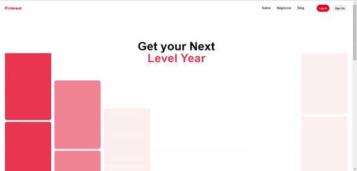

# UI Clone - Pinterest (Homepage)
Pinterest Homepage(https://br.pinterest.com/) UI Clone para estudo

### Preview

<h1 align="center">
  
</h1>

### Recursos 
- [x]  HTML, SCSS, JS

### Como acessar?
- Abra a pasta do projeto no VSCode
- Instale o plugin Live Server e Live Sass Compiler extension
- Clique com o lado direito do mouse em index.html > Open with Live Server
- Acesse o endereço gerado no Browser 🚀
